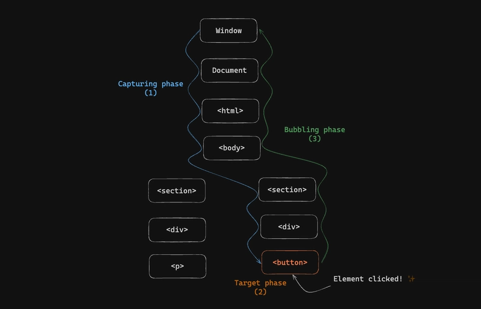

### **Event Bubbling ও Event Capturing বিস্তারিত বাংলায়**

ইভেন্ট হ্যান্ডলিং-এর দুটি গুরুত্বপূর্ণ ধারণা **Event Bubbling** এবং **Event Capturing**। এগুলো বোঝা না থাকলে Event Delegation সঠিকভাবে ব্যবহার করা যায় না।

---

### **১. Event Bubbling (ইভেন্ট বাবলিং)**

**সংজ্ঞা**: যখন কোনো এলিমেন্টে ইভেন্ট ঘটে, তখন সেই ইভেন্টটি **টার্গেট এলিমেন্ট থেকে শুরু করে ডম ট্রির উপরের দিকে প্যারেন্ট এলিমেন্টে পৌঁছায়**। যেন পানির বুদবুদ তল থেকে উপরে উঠছে।

#### **উদাহরণ**:

```html
<div id="parent">
  <button id="child">Click Me</button>
</div>
```

```javascript
document.getElementById("child").addEventListener("click", function () {
  console.log("Child clicked");
});

document.getElementById("parent").addEventListener("click", function () {
  console.log("Parent clicked");
});
```

**আউটপুট ক্রম**:

```
Child clicked
Parent clicked
```

**ব্যাখ্যা**:

- বাটনে ক্লিক করলে প্রথমে বাটনের ইভেন্ট চলে → তারপর ইভেন্টটি "বাবল আপ" হয়ে `div` প্যারেন্টে পৌঁছায়।
- **ডিফল্ট আচরণ**: সব ব্রাউজারে Bubbling ডিফল্টভাবে চালু থাকে।

---

### **২. Event Capturing (ইভেন্ট ক্যাপচারিং)**

**সংজ্ঞা**: Bubbling-এর **উল্টো প্রক্রিয়া**। ইভেন্ট প্রথমে **ডম ট্রির সবচেয়ে উপরের এলিমেন্ট (যেমন `window`) থেকে শুরু হয়ে টার্গেট এলিমেন্টের দিকে নেমে আসে**।

#### **উদাহরণ**:

```javascript
document.getElementById("parent").addEventListener(
  "click",
  function () {
    console.log("Parent capturing");
  },
  true
); // `true` = Capturing Phase

document.getElementById("child").addEventListener(
  "click",
  function () {
    console.log("Child capturing");
  },
  true
);
```

**আউটপুট ক্রম**:

```
Parent capturing
Child capturing
```

**ব্যাখ্যা**:

- ইভেন্ট প্রথমে `div` (প্যারেন্ট) ক্যাপচার করে → তারপর `button` (চাইল্ড) ক্যাপচার করে।
- **ব্যবহার**: বেশিরভাগ ক্ষেত্রে Capturing ব্যবহার হয় না। শুধু বিশেষ ক্ষেত্রে (যেমন নেটওয়ার্ক রিকোয়েস্ট হ্যান্ডলিং) লাগে।

---

### **ইভেন্ট প্রোপাগেশন তিনটি ধাপে কাজ করে:**

১. **ইভেন্ট ক্যাপচারিং (Capturing Phase):**

- এখানে ইভেন্টটি উপরের অভিভাবক উপাদান থেকে শুরু হয়ে নিচের দিকে (টার্গেট উপাদান পর্যন্ত) যাবে।
- সাধারণত এটি একটি খুব প্রথম পর্যায়, যেখানে আপনি ইভেন্টটি একটি প্যারেন্ট উপাদানে ক্যাপচার করতে পারেন।

2. **টার্গেট ফেজ (Target Phase):**

   - এই ধাপে, ইভেন্টটি সরাসরি টার্গেট উপাদানে পৌঁছায়। উদাহরণস্বরূপ, আপনি যদি একটি বাটনে ক্লিক করেন, তাহলে বাটনটি টার্গেট উপাদান হিসেবে কাজ করবে।

3. **ইভেন্ট বুব্বলিং (Bubbling Phase):**

   - এবার ইভেন্টটি টার্গেট উপাদান থেকে শুরু হয়ে তার অভিভাবক উপাদানগুলোর দিকে উঠতে থাকে। অর্থাৎ, প্রথমে টার্গেট উপাদান, তারপর তার প্যারেন্ট, তারপর প্যারেন্টের প্যারেন্ট, এমনভাবে উপরের দিকে চলে যায়।

### **ইভেন্ট ফ্লো ডায়াগ্রাম**

```
1. Capturing Phase:
   window → document → <html> → <body> → <div> (parent) → <button> (child)

2. Target Phase:
   <button> (টার্গেট এলিমেন্ট)

3. Bubbling Phase:
   <button> → <div> → <body> → <html> → document → window
```

---

### **৩. ইভেন্ট হ্যান্ডেল করার ৩টি ধাপ**

Event Delegation ব্যবহার করতে হলে নিচের ৩টি ধাপ অনুসরণ করুন:

#### **ধাপ ১: প্যারেন্ট এলিমেন্ট নির্বাচন করুন**

- সব চাইল্ড এলিমেন্টকে কন্ট্রোল করতে পারে এমন একটি **কমন প্যারেন্ট** বেছে নিন।
- উদাহরণ: টু-ডু লিস্টের জন্য `<ul id="todo-list">`।

#### **ধাপ ২: প্যারেন্টে ইভেন্ট লিসেনার যোগ করুন**

- প্যারেন্ট এলিমেন্টে **একটি মাত্র ইভেন্ট লিসেনার** অ্যাটাচ করুন।
- উদাহরণ:
  ```javascript
  document
    .getElementById("todo-list")
    .addEventListener("click", handleTodoClick);
  ```

#### **ধাপ ৩: টার্গেট এলিমেন্ট চেক করে অ্যাকশন নিন**

- ইভেন্ট হ্যান্ডলার ফাংশনে `event.target` ব্যবহার করে **কোন চাইল্ড এলিমেন্ট ক্লিক করা হয়েছে** তা যাচাই করুন।
- উদাহরণ:
  ```javascript
  function handleTodoClick(event) {
    // চেক: ক্লিক করা এলিমেন্ট <li> কিনা
    if (event.target.tagName === "LI") {
      event.target.remove(); // ক্লিক করা LI ডিলিট হবে
    }
  }
  ```

---

### **সম্পূর্ণ কোড উদাহরণ**

```html
<ul id="todo-list">
  <li>Task 1</li>
  <li>Task 2</li>
  <li>Task 3</li>
</ul>

<script>
  // ধাপ ১: প্যারেন্ট নির্বাচন
  const todoList = document.getElementById("todo-list");

  // ধাপ ২: প্যারেন্টে ইভেন্ট লিসেনার যোগ
  todoList.addEventListener("click", function (event) {
    // ধাপ ৩: টার্গেট চেক করে অ্যাকশন
    if (event.target.tagName === "LI") {
      event.target.remove();
    }
  });

  // নতুন আইটেম যোগ করা (ডাইনামিক কন্টেন্ট)
  const newItem = document.createElement("li");
  newItem.textContent = "New Task";
  todoList.appendChild(newItem); // অটোমেটিক ইভেন্ট হ্যান্ডেল হবে!
</script>
```

---

### **গুরুত্বপূর্ণ টিপস**

1. **`event.target` vs `event.currentTarget`**:

   - `event.target`: যে এলিমেন্টে **আসলে ক্লিক হয়েছে** (যেমন `<li>`)।
   - `event.currentTarget`: যে এলিমেন্টে **লিসেনার অ্যাটাচ করা হয়েছে** (যেমন `<ul>`)।

2. **নেস্টেড এলিমেন্ট হ্যান্ডেল করতে**:  
   যদি চাইল্ড এলিমেন্টের ভেতর আরও এলিমেন্ট থাকে (যেমন `<li><span>Text</span></li>`), তাহলে `event.target` `<span>` হতে পারে। সমাধান:

   ```javascript
   if (event.target.closest("li")) {
     event.target.closest("li").remove();
   }
   ```

3. **ইভেন্ট স্টপ করতে**:  
   যদি কোনো চাইল্ডে Bubbling বন্ধ করতে চান:
   ```javascript
   event.stopPropagation(); // ইভেন্ট প্যারেন্টে যাবে না
   ```

---



### **সারসংক্ষেপ**

| ধারণা         | ব্যাখ্যা                                                             |
| ------------- | -------------------------------------------------------------------- |
| **Bubbling**  | ইভেন্ট টার্গেট থেকে প্যারেন্টের দিকে যায় (ডিফল্ট)।                  |
| **Capturing** | ইভেন্ট প্যারেন্ট থেকে টার্গেটের দিকে আসে (বিরল ব্যবহার)।             |
| **৩ ধাপ**     | ১) প্যারেন্ট নির্বাচন → ২) লিসেনার যোগ → ৩) টার্গেট চেক করে অ্যাকশন। |

Event Delegation হলো **Bubbling**-এর সুবিধা নেওয়ার একটি কৌশল! 🚀

[Bubbling - Capturing](https://dev.to/thesanjeevsharma/event-flow-bubbling-capturing-37h0)
